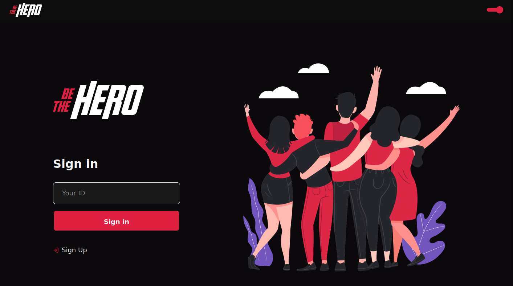
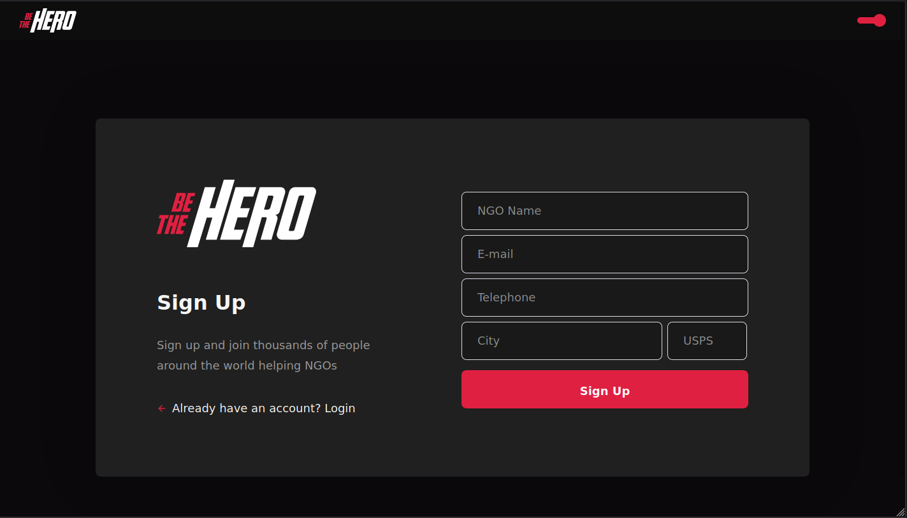
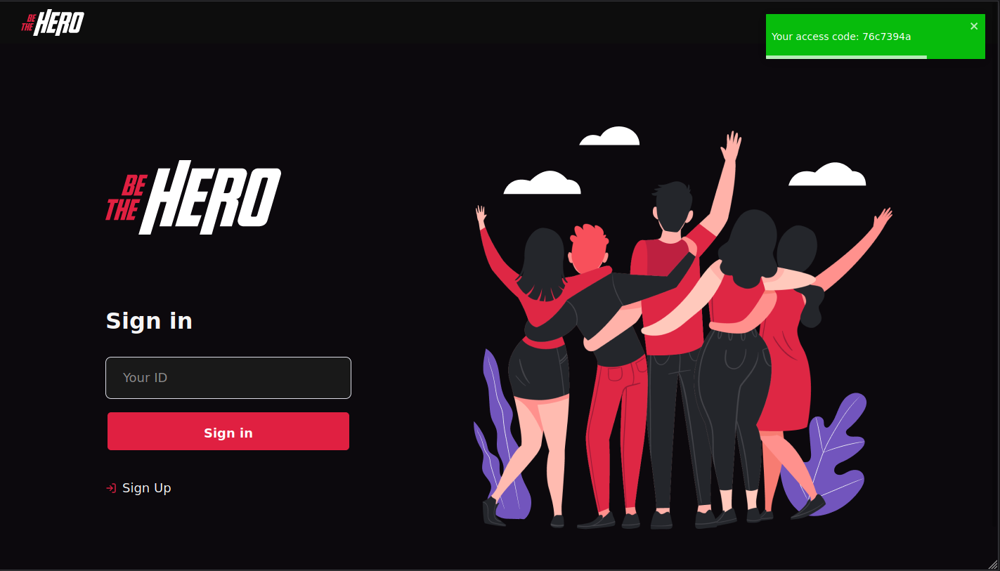
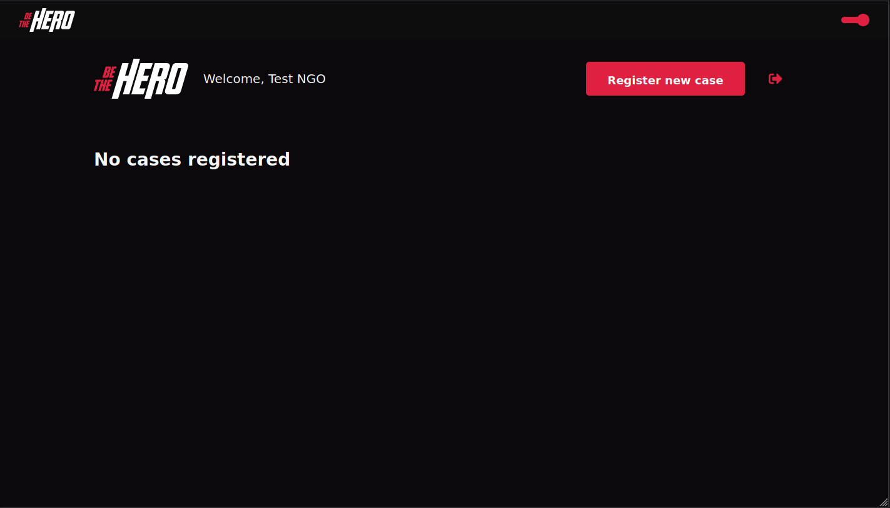
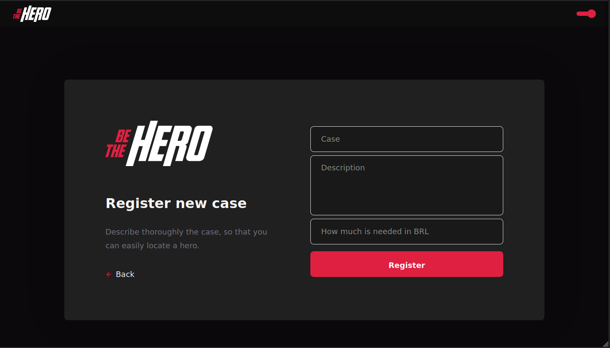
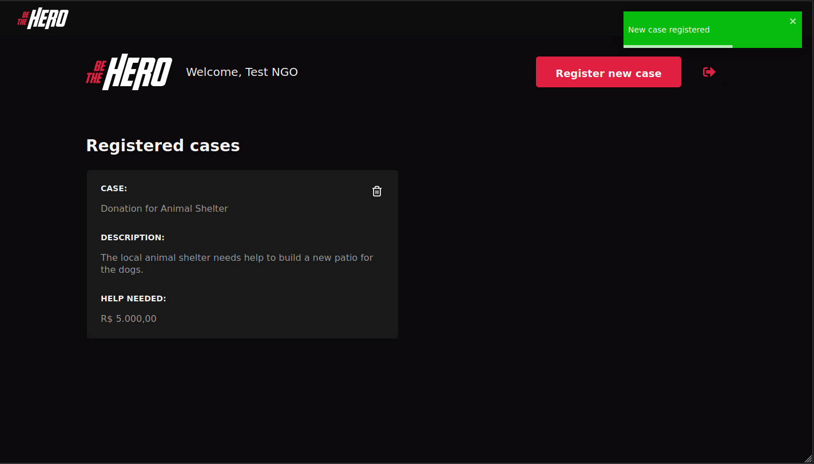

<h1 align="center">
   be-the-hero
</h1>

 

## 💻 Preview

## :rocket: Technologies

This app feature the following techs:

- [NodeJS](https://nodejs.org/en/)
- [ReactJS](https://github.com/facebook/react)

## 💻 Project

Be the hero is an app developed with React for the fronted and NodeJS for the backend, it's purpose is to create a place whe NGOs can easily advertise their projects and look for sponsors, or what they might refer to as a "hero", who help finance the project. 

## Getting started

1. Clone this repo using `git clone git@github.com:pedrozocatelli/be-the-hero.git`
2. Go to the project path directory: `cd be-the-hero` 
3. `cd api` to access the path of the api
4. Run `yarn` to install the dependencies
5. Keep the api running on another terminal
6. Now go to the `web` folder to start the frontend
7. Once there, run `yarn && yarn start` to start the project
---

